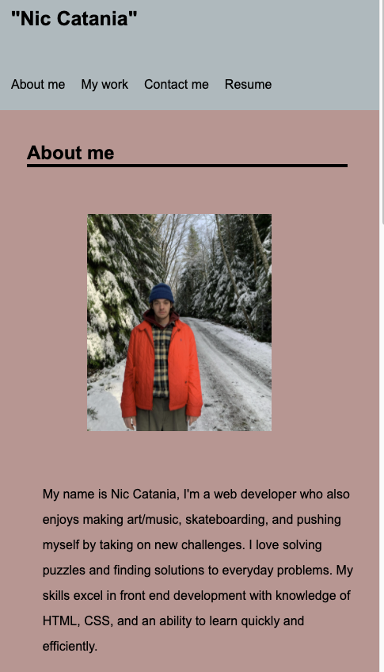
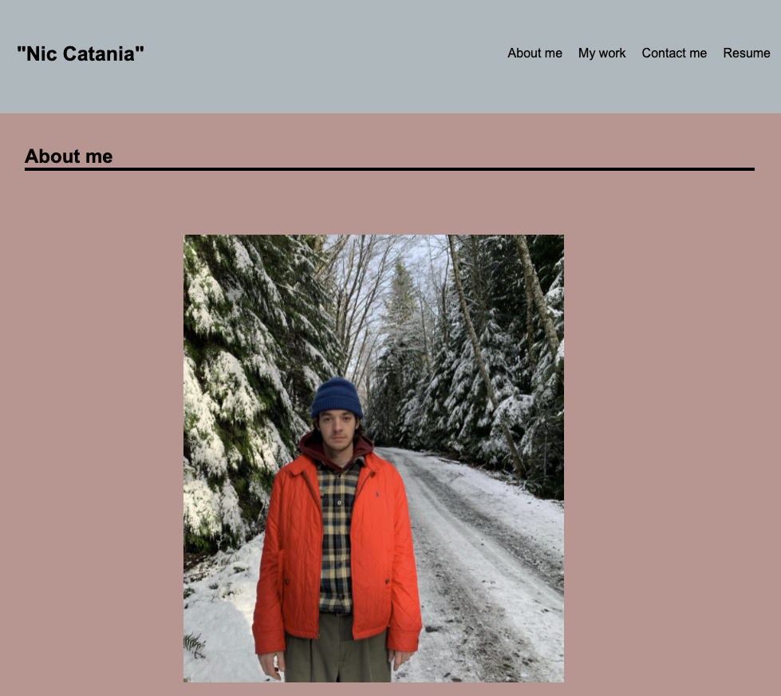
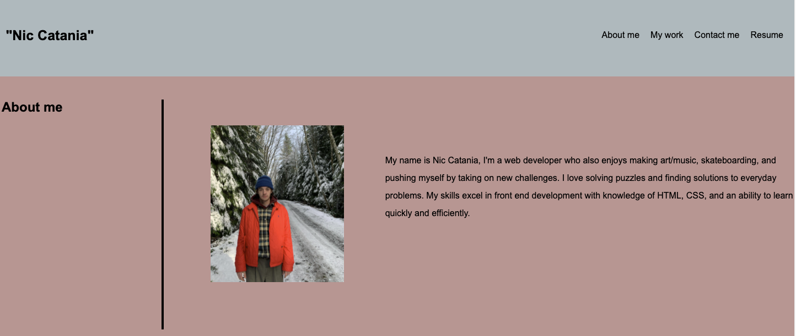

# <Portflio website design>

## Description

With this project I aimed to create a responsive website showcasing my newly learned HTML, and CSS abilities. This was completed by making a site from scratch that included a nav bar with links, an about me section, a work section (currently featuring placeholder images and one piece of work) and a contact me section with buttons I designed. this project features much use of the flex-box, and media queries to make it responsive for all screen sizes.

## Website link

https://niccatania.github.io/Portfolioworld/
 
## Installation

To edit code, download the index.html, and css stylesheet. Open in your prefered code editor.
If you'd like to add to this code please contact me through the email link featured on the site.
 

## Usage
  
  
A preview of the website in different sizes

  

  

## Credits

Original code written by Nic Catania

